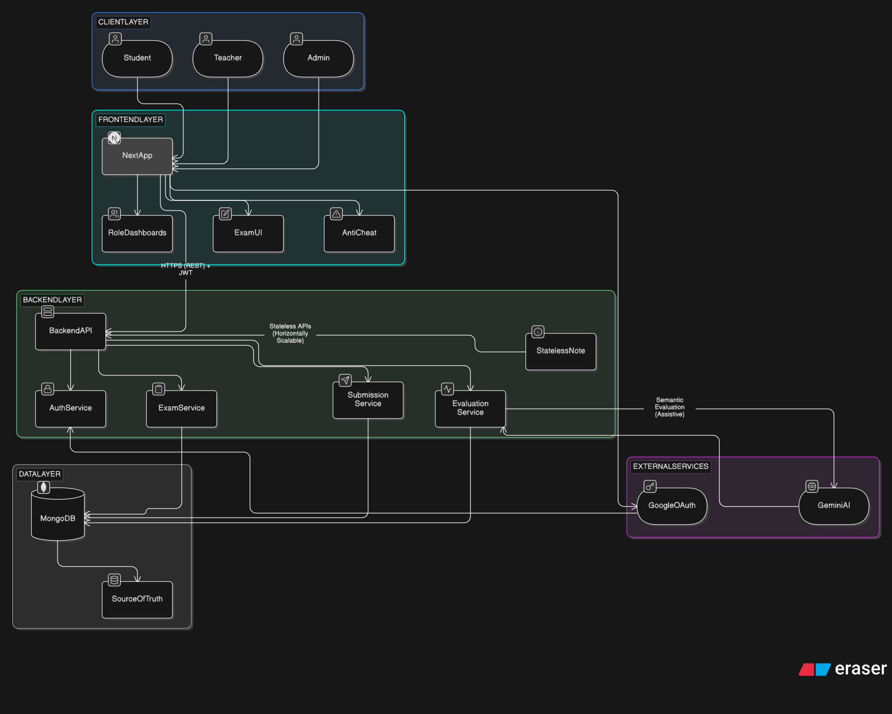

# 🎓 QuestEd — Scalable Online Examination Platform
QuestEd is a **production-grade online examination platform** designed with a **layered, stateless architecture** to support secure, role-based assessments and AI-assisted evaluation at scale.

**GitHub Repository:** https://github.com/Esar1212/QuestEd2

---

## 🚀 Live Demo

> https://quested.onrender.com

---

## Key Highlights (Recruiter Summary)

- Full-stack web application with clear frontend–backend separation
- **Stateless REST APIs** secured using JWT and OAuth
- **Role-based access control** (Student, Teacher, Admin)
- **AI-assisted evaluation** for descriptive answers (human-in-the-loop)
- MongoDB as the **single source of truth**
- Designed for **horizontal scalability and fault tolerance**

---

## Core Features

### Authentication & Authorization
- Google OAuth integration using NextAuth
- JWT-based authentication for API security
- Role-protected routes and actions
- Secure password hashing with bcrypt

### Examination Engine
- Timed online examinations
- Automatic submission handling
- Client-side anti-cheating (tab-switch detection)
- Persistent answer storage to prevent data loss

### Evaluation System
- Automatic grading for objective (MCQ) questions
- Descriptive answer evaluation using **semantic comparison**
- AI output treated as **assistive**, not authoritative
- Teacher review and override supported

---

## System Architecture

QuestEd follows a layered architecture with clear separation of concerns.  
The system is designed around **stateless backend APIs**, **role-based access control**, and **MongoDB as the single source of truth**, enabling horizontal scalability and fault-tolerant operation.

### Architectural Principles
- Stateless backend APIs → horizontally scalable
- MongoDB as the source of truth → crash-safe persistence
- Service-level decomposition → maintainability and clarity
- External services isolated → reduced blast radius

> Real-time infrastructure (e.g., WebSockets) is intentionally deferred to avoid premature complexity.

---

## High-Level Request Flow

1. Client interacts with the **Next.js frontend**
2. Frontend communicates with backend via **HTTPS REST APIs**
3. Backend services handle:
   - Authentication
   - Exam management
   - Submission persistence
   - Evaluation pipeline
4. MongoDB stores all authoritative application state
5. AI service is invoked only during evaluation

---
## 🛠️ Tech Stack

| Layer        | Technology                  |
|--------------|------------------------------|
| Frontend     | Next.js (App router)         |
| Backend      | Node.js (via Next.js API routes)|
| Database     | MongoDB + Mongoose ORM       |
| Auth         | JWT (JSON Web Tokens) + NextAuth |
| Deployment   |  Render                      |
| External Services |  OAuth and Gemini AI(semantic evaluation) |

---

  
